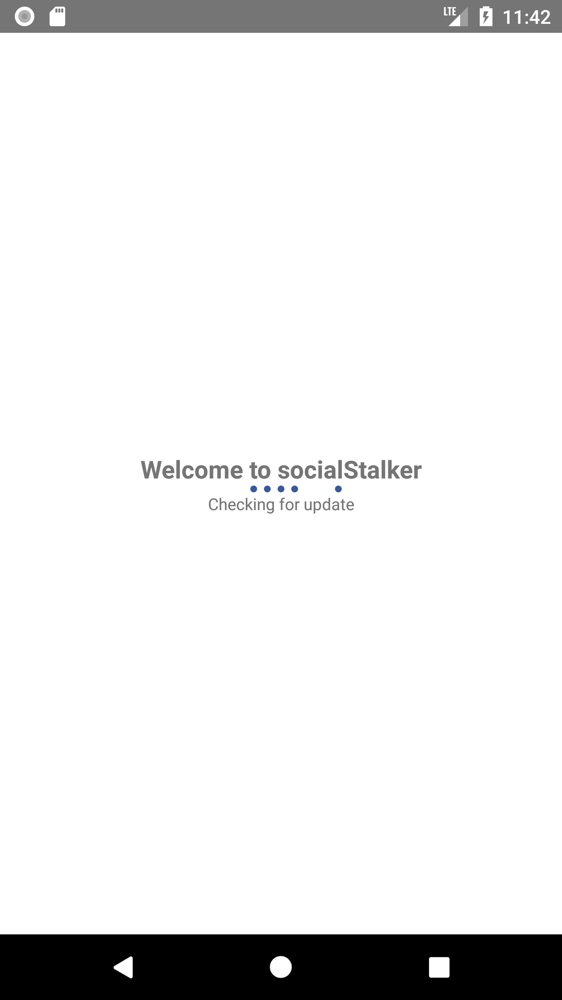
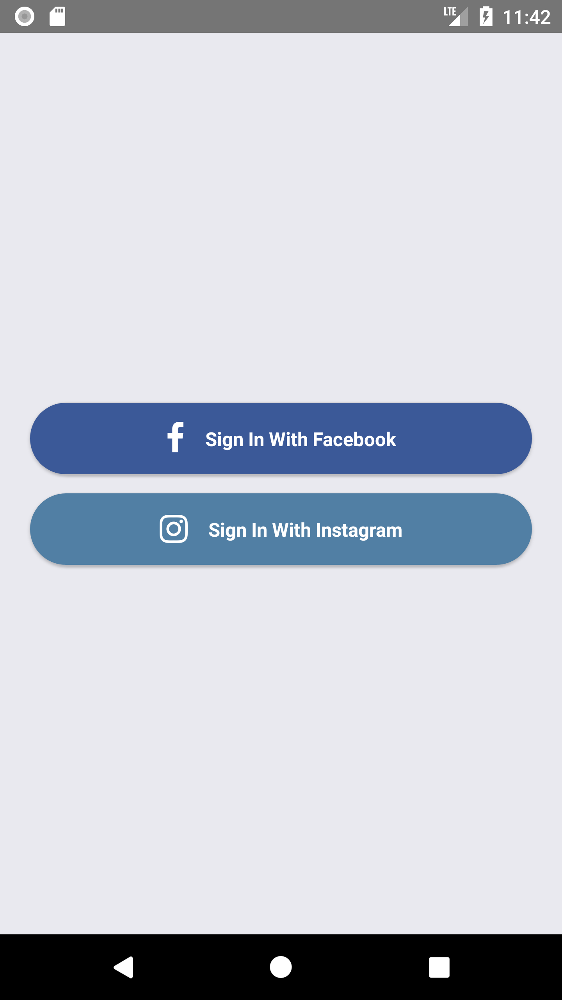
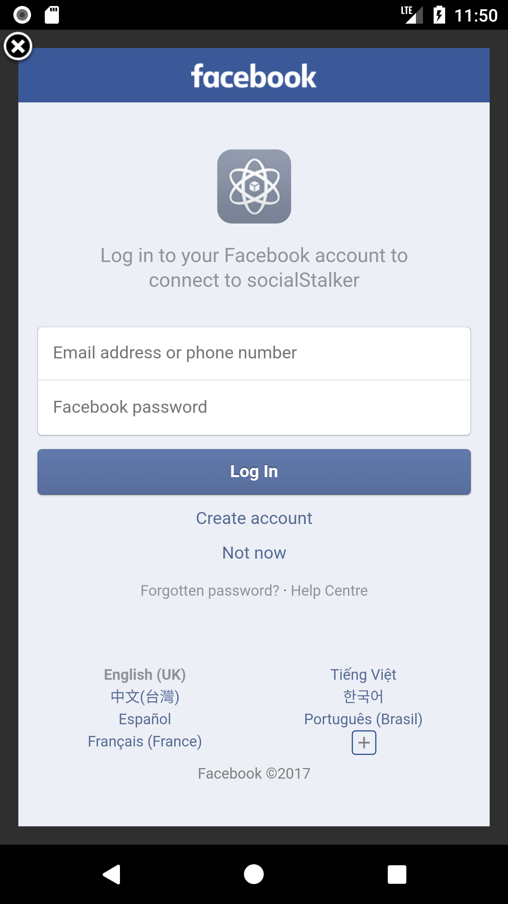
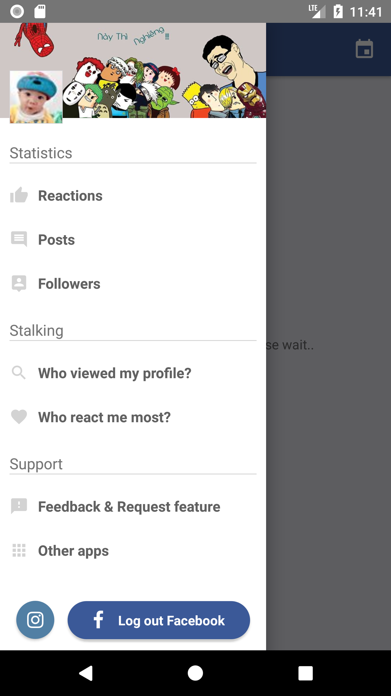

# Simple React Native application
A simple application, built with React Native, for scalable projects using Redux + React Navigation + Code Push + Realm + Axios + i18n + Google Analytics + Facebook login with fbsdk...

## Screenshots
- Splash screen: 
- Login:  
- Login by Facebook: 
- Menu: 

## Important dependencies:

- [Redux](http://redux.js.org)
- [React navigation](https://reactnavigation.org)
- [i18n](https://github.com/AlexanderZaytsev/react-native-i18n)
- [realm](https://github.com/realm/realm-js)
- [axios](https://github.com/axios/axios)
- [react-native-exception-handler](https://github.com/master-atul/react-native-exception-handler)
- [CodePush](https://github.com/Microsoft/react-native-code-push)
- [GoogleAnalyticsBridge](https://github.com/idehub/react-native-google-analytics-bridge)

## Quick start

1. Run `npm install`
2. Run unit tests using `npm run test:unit`
3. To run on device emulators, you have to have installed `react-native` npm module, then run `react-native run-ios` or `react-native run-android`. See more on [React Native getting started](https://facebook.github.io/react-native/docs/getting-started.html).
4. To run e2e tests run `npm run test:e2e`

##  Available Command  

| npm run ... | Description |
| --- | --- |
| adb-reverse | Reset port ADB to tcp:8081 |
| adb-forward | Forward port ADB to tcp:8083 |
| ios-dev| Run iOS project with Simulator set to "iPhone X" |
| ios-bundle | Bundle with entry file index.ios.js |
| ios-build  | Run ios project with “Release” configuration |
| android-clean | Fix building android if preDexDebug error |
| android-build-debug | Build android .apk with “Debug” configuration |
| android-release  | Build android .apk with “Release” configuration  |
| android-signkey  | Generate keystore android  |
| android-signer | To sign app-release-unsigned.apk with random keystore |
| android-dev | Run android development-mode on simulator |
| android-bundle | Bundle with entry file index.android.js |

## Tips

- Change keys and codes in .env file
- Change your Code Push key in iOS and Android project
- Change your Facebook app ID
- adb reverse tcp:8081 tcp:8081
- adb forward tcp:8083 tcp:8083

## License
MIT